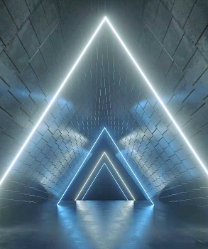
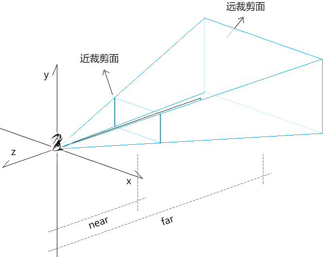
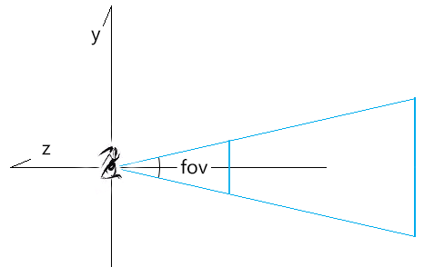
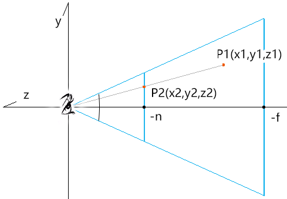
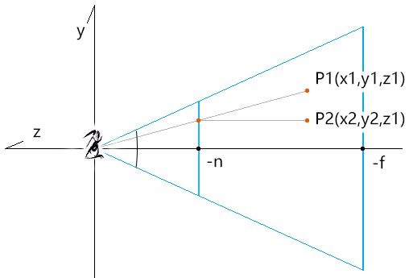
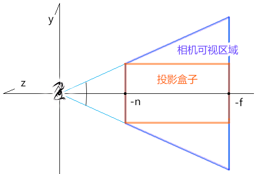
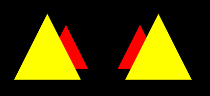
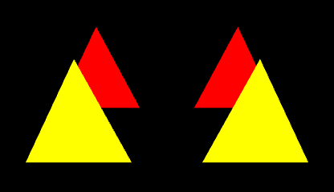
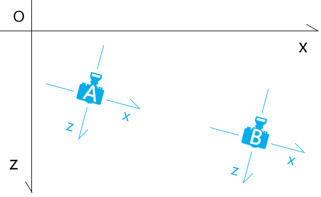

## 第五章 透视投影矩阵

透视投影矩阵可以将现实世界更真实的投射到裁剪空间中。

我们的肉眼看现实世界时，用的就是透视投影矩阵。



透视投影矩阵包含了许多的基础图形知识，这些知识在其它地方都是能单独用得上的。

透视投影矩阵是一个专业图形程序员所必备的，只有对其有了透彻的理解，我们才能有底气将薪资要到30K、或者40K之上。

接下来，为了让大家学起来更加流畅，咱们先强调点基础知识。


### 1-基础知识

为了让大家学起来更加丝滑，我再跟大家强调两个知识点。

#### 1-1-空间向量分解定理

如果三个向量a,b,c不共面，那么对空间任一向量p 存在一个唯一有序实数组x,y,z，使

```js
p=xa+yb+zc
```

a,b,c 再加上一个坐标原点O，可构成坐标系[O;a,b,c]

a,b,c 就叫做坐标向量。

(x,y,z)可理解为向量P在坐标系[O;a,b,c]中的向量。

我们可以将其写成矩阵形式：

```js
P=[a,b,c,O]*(x,y,z,0)
```

然而，当矩阵和向量(x,y,z,0)相乘时，因为向量的第4个分量是0，矩阵的原点O都会失效，就相当于零点一样。

这也是为什么，我们在说点位的时候，通常默认其第4个分量是1。

```
[a,b,c,O]*(x,y,z,1)
```

(x,y,z,1)中的1使得矩阵[a,b,c,O]中O 有了意义，使(x,y,z,1)增加了一个原点O的位移量。

因此：

- (x,y,z,0) 通常被认作是向量，因为向量没有位移概念。

- (x,y,z,1)通常被认作是点位，因为矩阵与其相乘时，它会受到原点O的位置影响。


用(x,y,z,1)表示坐标的方法就叫做齐次坐标表示法。

齐次坐标表示法，是计算机图形学中最常用的坐标表示方法，它不仅能明确区分向量和点位，还更易于进行线性几何变换。


#### 1-2-线性补间运算

之前我们说过点斜式y=kx+b，它就是线性补间运算的公式。

除了点斜式，两种数据间的线性映射关系还可以用其它方法来表示。

已知：

- N类型的数据极值是[minN,maxN]

- M类型的数据极值是[minM,maxM]

- x属于N

- 将x映射到M的中的值为y


则：

x、y满足以下关系式：

```js
(x-minN)/(maxN-minN)=(y-minM)/(maxM-minM)
```

设：

```js
k=(maxM-minM)/(maxN-minN)
b=minM-minN*k
```

则：

```
y=kx+b
```

通过线性插值的特性，我们可以知道：

[minN,maxN]中的每个点都与[minM,maxM]中的唯一点相对应，由一个x便可以求出唯一一个y。

基础知识咱们就先说到这，接下来咱们认识一下透视投影矩阵。


### 2-认识透视投影矩阵

透视投影矩阵是3d引擎的重要组成部分。

透视投影矩阵所对应的相机是透视相机。

透视相机的可视区域是四棱锥形的，这种形状也叫做视椎体。

透视投影矩阵通常会将视椎体中的现实世界投射到一个以近裁剪面为上下左右边界，以近裁剪面和远裁剪面到视点的距离为深度边界的盒子里，然后再将这个盒子塞进裁剪空间里进行显示。


 





透视相机的建立需要以下已知条件：

-   fov：摄像机视锥体垂直视野角度
-   aspect：摄像机视锥体宽高比
-   near：摄像机近裁剪面到视点的距离
-   far：摄像机远裁剪面到视点的距离

投影矩阵的建立要按照以下几步走：

1.基于fov、aspect、near、far 计算近裁剪面边界。

2.把现实世界中的顶点打到近裁剪面上，获取投影的x,y值，保留原始的z值，构成新的点位

新的点位所在的区间是一个以近裁剪面为上下左右边界，以近裁剪面和远裁剪面到视点的距离为深度边界的投影盒子。

3.把投影盒子里的顶点塞进裁剪空间中。

4.基于上面的变换规律，提取投影矩阵。

接下来咱们就去计算一下透视投影矩阵。


### 3-计算透视投影矩阵

1.基于fov、aspect、n(near)、f(far)计算近裁剪面边界。


```
top=n*tan(fov/2)
bottom=-top
right=top*aspect
left=-right
```


2.把现实世界中的顶点P1打到近裁剪面上，获取投影的x,y值，保留原始的z值，构成新的点位P2




由相似三角形性质得：

```
x1/x2=y1/y2=z1/z2
```

因为：

```
z2=-n
```

所以：

```
x2=n*x1/-z1
y2=n*y1/-z1
```

z2的值，按理说应该是-n，但为了以后的空间运算，我们需要先保留顶点的深度数据。

所以最终P2应该是这样的：




由上图可以，这一步所做的，就把相机的可视区域收束到投影盒子里。





3.把投影盒子里的顶点塞进裁剪空间中。

我们需要在x,y,z 三个方向上，将投影盒子里的顶点映射到裁剪空间中。

设：

映射到裁剪空间中的点为P3(x3,y3,z3) 点

则：

P2点和P3点满足以下关系式：

- x方向

```
(x3-(-1))/(1-(-1))=(x2-left)/(right-left)
x3=(2*n/(right-left))*x1/-z1-(right+left)/(right-left)
```


- y方向

```
(y3-(-1))/(1-(-1))=(y2-bottom)/(top-bottom)
y3=(2*n/(top-bottom))*y1/-z1-(top+bottom)/(top-bottom)
```


- z 方向

大家可能会想到像之前的x3、y3轴向那样计算z3：

```js
(z3-(-1))/(1-(-1))=(z1-(-n))/(-f-(-n))
```

但是为了以后便于矩阵运算，我们得将z3 值换一种表现形式。

观察一下当前求出的P3点的x3,y3值：

```
x3=(2*n/(right-left))*x1/-z1-(right+left)/(right-left)
y3=(2*n/(top-bottom))*y1/-z1-(top+bottom)/(top-bottom)
```

只要让x3,y3 乘以-z1，便可以得到P4(x4,y4,z4,w4)：

```
x4=(2*n/(right-left))*x1+((right+left)/(right-left))*z1
y4=(2*n/(top-bottom))*y1+((top+bottom)/(top-bottom))*z1
z4=z3*-z1
w4=-z1
```

这样便可以从中提取矩阵(行主序)因子：

```
[
  2n/(right-left)       0         (right+left)/(right-left)   0,
  0              2n/(top-bottom)  (top+bottom)/(top-bottom)   0,
  0                     0          ?                          ?,
  0                     0          -1                         0
]
```


接下来，就剩下z轴相关的矩阵因子了。

z3值是在投影空间和裁剪空间中做线性运算，因此其数据结构符合点斜式z3=k*z1+b。

将其放进矩阵中，k对应着矩阵中z轴的z分量，b对应着z轴的w分量。

同时，为了方便矩阵运算，我们还得让z3除以-z。

z3的最终结构如下：

```
z3=(k*z1+b)/-z1
```

接下来我们解出上面的k值和b值，便可以得到z3。

构建一个二元一次方程组：

- 当z3=-1 时，z1=-n，即：

```
-1=(-k*n+b)/n
k=b/n+1
```


- 当z3=1 时，z1=-f，即：

```
1=(-k*f+b)/f
b=f+k*f
```


用消元法求b：

```
b=f+(b/n+1)*f
b=-2*f*n/(f-n)
```

再求a：

```
k=(-2*f*n/(f-n))/n+1
k=-(f+n)/(f-n)
```


最终得到P3:

```
P3=(
	(2*n/(right-left))*x1/-z1-(right+left)/(right-left)
	(2*n/(top-bottom))*y1/-z1-(top+bottom)/(top-bottom)
	(-(f+n)/(f-n)*z1-2*f*n/(f-n))/-z1,
	1
)
```


4.对P3进行一下变换，使其每个分量都乘以-z，得P4(x4,y4,z4,w4)：

```
x4=2*n*x1/(right-left)+((right+left)/(right-left))*z,
y4=2*n*y1/(top-bottom)+((top+bottom)/(top-bottom))*z,
z4=-(f+n)/(f-n)*z1-2*f*n/(f-n),
w4=-z
```

注：P4就是齐次坐标表示法，P4所蕴含的坐标信息量和P3是一样的。


5.从P4中分解出四维矩阵ProjectionMatrix(行主序)：

```
ProjectionMatrix=[
  2n/(right-left)       0         (right+left)/(right-left)   0,
  0              2n/(top-bottom)  (top+bottom)/(top-bottom)   0,
  0                     0          -(f+n)/(f-n)              -2*f*n/(f-n),
  0                     0          -1                         0
]
```

注：

```
P4=ProjectionMatrix*P1
```

透视投影的建立方法，我们可以从three.js 的源码里找到。


### 4-three.js 里的透视投影矩阵

three.js 的PerspectiveCamera对象的updateProjectionMatrix() 方法，便是透视相机建立透视投影矩阵的方法。


```js
updateProjectionMatrix() {
    const near = this.near;
	//近裁剪面上边界
    let top = near * Math.tan( MathUtils.DEG2RAD * 0.5 * this.fov ) / this.zoom;
    //近裁剪面高度
    let height = 2 * top;
    //近裁剪面宽度
    let width = this.aspect * height;
    //近裁剪面左边界
    let left = - 0.5 * width;
    //默认为null
    const view = this.view;

    //多视图
    if ( this.view !== null && this.view.enabled ) {
        const fullWidth = view.fullWidth,
              fullHeight = view.fullHeight;
        left += view.offsetX * width / fullWidth;
        top -= view.offsetY * height / fullHeight;
        width *= view.width / fullWidth;
        height *= view.height / fullHeight;

    }
    //偏离值，默认0
    const skew = this.filmOffset;
    if ( skew !== 0 ) left += near * skew / this.getFilmWidth();
	
    //基于近裁剪面边界、近裁剪面和远裁剪面到相机视点的距离设置投影矩阵
    this.projectionMatrix.makePerspective( left, left + width, top, top - height, near, this.far );

    //投影矩阵的逆矩阵
    this.projectionMatrixInverse.copy( this.projectionMatrix ).invert();

}
```


- makePerspective() 是Matrix4对象里的方法，会基于投影空间建立透视投影矩阵

```js
makePerspective( left, right, top, bottom, near, far ) {
    const te = this.elements;
    
    const x = 2 * near / ( right - left );
    const y = 2 * near / ( top - bottom );
    const a = ( right + left ) / ( right - left );
    const b = ( top + bottom ) / ( top - bottom );
    const c = - ( far + near ) / ( far - near );
    const d = - 2 * far * near / ( far - near );

    te[ 0 ] = x;	te[ 4 ] = 0;	te[ 8 ] = a;	te[ 12 ] = 0;
    te[ 1 ] = 0;	te[ 5 ] = y;	te[ 9 ] = b;	te[ 13 ] = 0;
    te[ 2 ] = 0;	te[ 6 ] = 0;	te[ 10 ] = c;	te[ 14 ] = d;
    te[ 3 ] = 0;	te[ 7 ] = 0;	te[ 11 ] = - 1;	te[ 15 ] = 0;

    return this;
}
```


### 5-透视投影矩阵牛刀小试

我们用透视投影矩阵展示几个可以近大远小的三角形。



1.着色器

```html
<script id="vertexShader" type="x-shader/x-vertex">
  attribute vec4 a_Position;
  uniform mat4 u_ProjectionMatrix;
  void main(){
  	gl_Position = u_ProjectionMatrix*a_Position;
  }
</script>
<script id="fragmentShader" type="x-shader/x-fragment">
  precision mediump float;
  uniform vec4 u_Color;
  void main(){
  	gl_FragColor=u_Color;
  }
</script>
```


2.初始化着色器

```js
import { initShaders } from '../jsm/Utils.js';
import { Matrix4,PerspectiveCamera, Vector3, Quaternion, Object3D, OrthographicCamera } from 'https://unpkg.com/three/build/three.module.js';
import Poly from './jsm/Poly.js'

const canvas = document.getElementById('canvas');
const [viewW, viewH] = [window.innerWidth, window.innerHeight]
canvas.width = viewW;
canvas.height = viewH;
const gl = canvas.getContext('webgl');

const vsSource = document.getElementById('vertexShader').innerText;
const fsSource = document.getElementById('fragmentShader').innerText;
initShaders(gl, vsSource, fsSource);
gl.clearColor(0.0, 0.0, 0.0, 1.0);
```


3.建立透视相机

```js
const [fov,aspect,near,far]=[
    45,
    canvas.width / canvas.height,
    1,
    20
]
const camera = new PerspectiveCamera(fov,aspect,near,far)
```


4.基于相机的透视投影矩阵，绘制4个三角形。

前面是两个黄色三角形，后面是两个红色三角形。

```js
const triangle1 = crtTriangle(
    [1, 0, 0, 1],
    [-0.5,0,-3]
)

const triangle2 = crtTriangle(
    [1, 0, 0, 1],
    [0.5,0,-3]
)

const triangle3 = crtTriangle(
    [1, 1, 0, 1],
    [-0.5,0,-2]
)

const triangle4 = crtTriangle(
    [1, 1, 0, 1],
    [0.5,0,-2]
)

function crtTriangle(color, [x,y,z]) {
    return new Poly({
        gl,
        source: [
            x, 0.3+y, z,
            -0.3+x, -0.3+y, z,
            0.3+x, -0.3+y, z,
        ],
        type: 'TRIANGLES',
        attributes: {
            a_Position: {
                size: 3,
                index: 0
            },
        },
        uniforms: {
            u_Color: {
                type: 'uniform4fv',
                value: color
            },
            u_ProjectionMatrix: {
                type: 'uniformMatrix4fv',
                value: camera.projectionMatrix.elements
            },
        }
    })
}

gl.clear(gl.COLOR_BUFFER_BIT);
render()

function render() {
    gl.clear(gl.COLOR_BUFFER_BIT);

    triangle1.init()
    triangle1.draw()
	
    triangle2.init()
    triangle2.draw()

    triangle3.init()
    triangle3.draw()

    triangle4.init()
    triangle4.draw()
}
```


实际项目中，只有投影矩阵是不够的，还要有视图矩阵和模型矩阵。


## 第六章 投影矩阵、视图矩阵、模型矩阵共冶一炉

投影矩阵、视图矩阵、模型矩阵的结合方式：

```
最终的顶点坐标=投影矩阵*视图矩阵*模型矩阵*初始顶点坐标
```


### 1-投影视图矩阵

1.在顶点着色器里把投影矩阵变成投影视图矩阵。

```html
<script id="vertexShader" type="x-shader/x-vertex">
    attribute vec4 a_Position;
    uniform mat4 u_PvMatrix;
    void main(){
      gl_Position = u_PvMatrix*a_Position;
    }
</script>
```


2.设置相机位置，并让其看向一点

```js
const eye = new Vector3(0, 1, 1)
const target = new Vector3(0, 0, -2.5)
const up = new Vector3(0, 1, 0)

const [fov,aspect,near,far]=[
    45,
    canvas.width / canvas.height,
    1,
    20
]

const camera = new PerspectiveCamera(fov,aspect,near,far)
camera.position.copy(eye)
camera.lookAt(target)
camera.updateWorldMatrix(true)
```


3.计算投影视图矩阵，即让相机的投影矩阵乘以视图矩阵

```js
const pvMatrix = new Matrix4()
pvMatrix.multiplyMatrices(
    camera.projectionMatrix,
    camera.matrixWorldInverse,
)
```


4.修改一下建立三角形方法里的uniform 变量

```js
u_PvMatrix: {
    type: 'uniformMatrix4fv',
    value: pvMatrix.elements
},
```

效果如下：




接下来，我们再把模型矩阵加进去。


### 2-投影视图矩阵乘以模型矩阵

之前我们设置三角形位置的时候，是直接对顶点的原始数据进行的修改。

```js
source: [
    x, 0.3 + y, z,
    -0.3 + x, -0.3 + y, z,
    0.3 + x, -0.3 + y, z,
],
```

其实，我是可以将位移数据写进模型矩阵里的，当然旋转和缩放数据也可以写进去，然后用模型矩阵乘以原始顶点，从而实现对模型的变换。


1.顶点着色器

```js
attribute vec4 a_Position;
uniform mat4 u_PvMatrix;
uniform mat4 u_ModelMatrix;
void main(){
    gl_Position = u_PvMatrix*u_ModelMatrix*a_Position;
}
```


2.在crtTriangle()方法里，把三角形的数据源写死，在uniforms 里添加一个模型矩阵。

```js
function crtTriangle(color, modelMatrix) {
    return new Poly({
        gl,
        modelMatrix,
        source: [
            0, 0.3, 0,
            -0.3, -0.3, 0,
            0.3, -0.3, 0,
        ],
        type: 'TRIANGLES',
        attributes: {
            a_Position: {
                size: 3,
                index: 0
            },
        },
        uniforms: {
            u_Color: {
                type: 'uniform4fv',
                value: color
            },
            u_PvMatrix: {
                type: 'uniformMatrix4fv',
                value: pvMatrix.elements
            },
            u_ModelMatrix: {
                type: 'uniformMatrix4fv',
                value: modelMatrix
            },
        }
    })
}
```


2.建立四个三角形

```js
const triangle1 = crtTriangle(
    [1, 0, 0, 1],
    [
        1, 0, 0, 0,
        0, 1, 0, 0,
        0, 0, 1, 0,
        -0.5, 0, -3, 1,
    ]
)

const triangle2 = crtTriangle(
    [1, 0, 0, 1],
    [
        1, 0, 0, 0,
        0, 1, 0, 0,
        0, 0, 1, 0,
        0.5, 0, -3, 1,
    ]
)

const triangle3 = crtTriangle(
    [1, 1, 0, 1],
    [
        1, 0, 0, 0,
        0, 1, 0, 0,
        0, 0, 1, 0,
        -0.5, 0, -2, 1,
    ]
)

const triangle4 = crtTriangle(
    [1, 1, 0, 1],
    [
        1, 0, 0, 0,
        0, 1, 0, 0,
        0, 0, 1, 0,
        0.5, 0, -2, 1,
    ]
)
```


效果如下：


## 第七章 相机轨道控制器

相机轨道控制器可以让我们更好的变换相机，从而灵活观察物体。

three.js 中的相机轨道控制器是通过以下事件变换相机的：

- 旋转
  - 鼠标左键拖拽
  - 单手指移动

- 缩放
  - 鼠标滚轮滚动
  - 两个手指展开或挤压

- 平移
  - 鼠标右键拖拽
  - 鼠标左键+ctrl/meta/shiftKey 拖拽
  - 箭头键
  - 两个手指移动

在实际项目开发中，我们不能对three.js 里的相机轨道控制器太过依赖。

因为其不能满足我们图形项目里的所有需求，这是经验之谈，好多同学都遇到过这种情况。

面对这样的情况，我们若不能充分理解相机轨道控制器的实现原理，整个项目都会被卡住。

所以，我们接下来要从最底层实现相机轨道控制器。

我们先使用相机轨道控制器变换正交相机。


### 1-正交相机的位移轨道

#### 1-1-搭建场景

准备4个三角形+1个相机

- 着色器

```html
<script id="vertexShader" type="x-shader/x-vertex">
    attribute vec4 a_Position;
    uniform mat4 u_PvMatrix;
    uniform mat4 u_ModelMatrix;
    void main(){
      gl_Position = u_PvMatrix*u_ModelMatrix*a_Position;
    }
</script>
<script id="fragmentShader" type="x-shader/x-fragment">
    precision mediump float;
    uniform vec4 u_Color;
    void main(){
      gl_FragColor=u_Color;
    }
</script>
```


- 初始化着色器

```js
import { initShaders } from '../jsm/Utils.js';
import {
    Matrix4, PerspectiveCamera, Vector2, Vector3, Quaternion, Object3D,
    OrthographicCamera
} from 'https://unpkg.com/three/build/three.module.js';
import Poly from './jsm/Poly.js'

const canvas = document.getElementById('canvas');
const [viewW, viewH] = [window.innerWidth, window.innerHeight]
canvas.width = viewW;
canvas.height = viewH;
const gl = canvas.getContext('webgl');

const vsSource = document.getElementById('vertexShader').innerText;
const fsSource = document.getElementById('fragmentShader').innerText;
initShaders(gl, vsSource, fsSource);
gl.clearColor(0.0, 0.0, 0.0, 1.0);
```


- 正交相机

```js
const halfH = 2
const ratio = canvas.width / canvas.height
const halfW = halfH * ratio
const [left, right, top, bottom, near, far] = [
    -halfW, halfW, halfH, -halfH, 1, 8
]
const eye = new Vector3(1, 1, 2)
const target = new Vector3(0, 0, -3)
const up = new Vector3(0, 1, 0)

const camera = new OrthographicCamera(
    left, right, top, bottom, near, far
)
camera.position.copy(eye)
camera.lookAt(target)
camera.updateMatrixWorld()
const pvMatrix = new Matrix4()
pvMatrix.multiplyMatrices(
    camera.projectionMatrix,
    camera.matrixWorldInverse,
)
```


- 4个三角形

```js
const triangle1 = crtTriangle(
    [1, 0, 0, 1],
    new Matrix4().setPosition(-0.5, 0, -4).elements
)
const triangle2 = crtTriangle(
    [1, 0, 0, 1],
    new Matrix4().setPosition(0.5, 0, -4).elements
)
const triangle3 = crtTriangle(
    [1, 1, 0, 1],
    new Matrix4().setPosition(-0.8, 0, -2).elements
)
const triangle4 = crtTriangle(
    [1, 1, 0, 1],
    new Matrix4().setPosition(0.5, 0, -2).elements
)

render()
function render() {
    gl.clear(gl.COLOR_BUFFER_BIT);

    triangle1.init()
    triangle1.draw()

    triangle2.init()
    triangle2.draw()

    triangle3.init()
    triangle3.draw()

    triangle4.init()
    triangle4.draw()

}
```


#### 1-2-声明基础数据

- 鼠标事件集合

```js
const mouseButtons = new Map([
    [2, 'pan']
])
```

​	2：鼠标右键按下时的event.button值

​	pan：平移


- 轨道控制器状态，表示控制器正在对相机进行哪种变换。比如state等于pan 时，代表位移

```
let state = 'none'
```


- 鼠标在屏幕上拖拽时的起始位和结束位，以像素为单位

```js
const dragStart = new Vector2()
const dragEnd = new Vector2()
```


- 鼠标每次移动时的位移量，webgl坐标量

```js
const panOffset = new Vector3()
```


- 鼠标在屏幕上垂直拖拽时，是基于相机本地坐标系的y方向还是z方向移动相机
  - true：y向移动
  - false：z向移动

```js
const screenSpacePanning = true
```


#### 1-3-在canvas上绑定鼠标事件

- 取消右击菜单的显示

```js
canvas.addEventListener('contextmenu', event => {
    event.preventDefault()
})
```


- 指针按下时，设置拖拽起始位，获取轨道控制器状态。

```js
canvas.addEventListener('pointerdown', ({ clientX, clientY, button }) => {
    dragStart.set(clientX, clientY)
    state = mouseButtons.get(button)
})
```

注：指针事件支持多种方式的指针顶点输入，如鼠标、触控笔、触摸屏等。


- 指针移动时，若控制器处于平移状态，平移相机。

```js
canvas.addEventListener('pointermove', (event) => {
    switch (state) {
        case 'pan':
            handleMouseMovePan(event)
    }
})
```


- 指针抬起时，清除控制器状态。

```js
canvas.addEventListener('pointerup', (event) => {
    state = 'none'
})
```

接下来我们重点看一下相机平移方法handleMouseMovePan()。


#### 1-4-相机平移方法

相机平移方法 

```js
function handleMouseMovePan({ clientX, clientY, button }) {
    //指针拖拽的结束位(像素单位)
    dragEnd.set(clientX, clientY)
    //基于拖拽距离(像素单位)移动相机
    pan(dragEnd.clone().sub(dragStart))
    //重置拖拽起始位
    dragStart.copy(dragEnd)
}
```


- 基于拖拽距离(像素单位)移动相机

  




```js
function pan(delta) {
    //相机近裁剪面尺寸
    const cameraW = camera.right - camera.left
    const cameraH = camera.top - camera.bottom
    //指针拖拽量在画布中的比值
    const ratioX = delta.x / canvas.clientWidth
    const ratioY = delta.y / canvas.clientHeight
    //将像素单位的位移量转换为相机近裁剪面上的位移量
    const distanceLeft = ratioX * cameraW
    const distanceUp = ratioY * cameraH
	//相机本地坐标系里的x轴
    const mx = new Vector3().setFromMatrixColumn(camera.matrix, 0)
	//相机x轴平移量
    const vx = mx.clone().multiplyScalar(-distanceLeft)
    //相机z|y轴平移量
    const vy = new Vector3()
    if (screenSpacePanning) {
        //y向
        vy.setFromMatrixColumn(camera.matrix, 1)
    } else {
        //-z向
        vy.crossVectors(camera.up, mx)
    }
    //相机y向或-z向的平移量
    vy.multiplyScalar(distanceUp)
	//整合平移量
    panOffset.copy(vx.add(vy))
	//更新
    update()
}
```


- 基于平移量，位移相机，更新投影视图矩阵

```js
function update() {
    target.add(panOffset)
    camera.position.add(panOffset)
    camera.lookAt(target)
    camera.updateWorldMatrix(true)
    pvMatrix.multiplyMatrices(
        camera.projectionMatrix,
        camera.matrixWorldInverse,
    )
    render()
}
```


### 2-正交相机的缩放轨道

#### 2-1-正交相机的缩放原理

相机的缩放就是让我们在裁剪空间中看到的同一深度上的东西更多或者更少。

通常大家很容易结合实际生活来考虑，比如我们正对着一面墙壁，墙壁上铺满瓷砖。

当我们把镜头拉近时，看到的瓷砖数量就变少了，每块瓷砖的尺寸也变大了；

反之，当我们把镜头拉远时，看到的瓷砖数量就变多了，每块瓷砖的尺寸也变小了。

然而这种方式只适用于透视相机，并不适用于正交相机，因为正交相机不具备近大远小规则。

正交相机的缩放，是直接缩放的投影面，这个投影面在three.js里就是近裁剪面。

当投影面变大了，那么能投影的顶点数量也就变多了；

反之，当投影面变小了，那么能投影的顶点数量也就变少了。


接下来，我们去分析一下相机的具体缩放方法。


#### 2-2-正交相机缩放方法

在three.js里的正交相机对象OrthographicCamera的updateProjectionMatrix() 方法里可以找到正交相机的缩放方法。

```js
updateProjectionMatrix: function () {
    const dx = ( this.right - this.left ) / ( 2 * this.zoom );
    const dy = ( this.top - this.bottom ) / ( 2 * this.zoom );
    const cx = ( this.right + this.left ) / 2;
    const cy = ( this.top + this.bottom ) / 2;
    
    let left = cx - dx;
    let right = cx + dx;
    let top = cy + dy;
    let bottom = cy - dy;
    ……
}
```


我们可以将上面的dx、dy分解一下：

- 近裁剪面宽度的一半width：( this.right - this.left ) / 2
- 近裁剪面高度的一半height：( this.top - this.bottom ) / 2
- dx=width/zoom
- dy=height/zoom

在three.js 里，zoom 的默认值是1，即不做缩放。

由上我们可以得到正交相机缩放的性质：

- zoom值和近裁剪面的尺寸成反比
- 近裁剪面的尺寸和我们在同一深度所看物体的数量成正比
- 近裁剪面的尺寸和我们所看的同一物体的尺寸成反比


#### 2-4-正交相机缩放轨道的实现

基于之前的相机位移轨道继续写代码。

1.定义滚轮在每次滚动时的缩放系数

```js
const zoomScale = 0.95
```


2.为canvas添加滚轮事件

```js
canvas.addEventListener('wheel', handleMouseWheel)

function handleMouseWheel({ deltaY }) {
    if (deltaY < 0) {
        dolly(1 / zoomScale);
    } else if (deltaY > 0) {
        dolly(zoomScale);
    }
    update();
}
```

当 deltaY<0 时，是向上滑动滚轮，会缩小裁剪面；

当 deltaY>0 时，是向下滑动滚轮，会放大裁剪面。


3.通过dolly()方法缩放相机

```js
function dolly(dollyScale) {
    camera.zoom *= dollyScale
    camera.updateProjectionMatrix();
}
```


