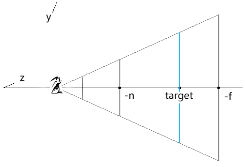
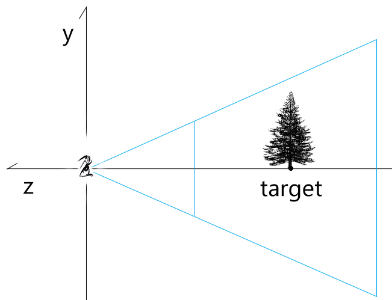
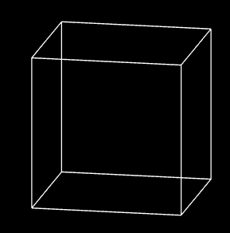
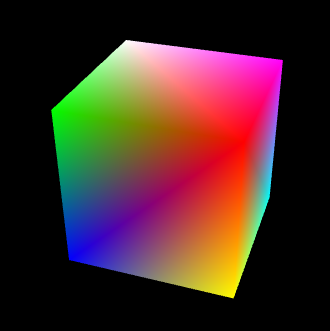

## 第八章 透视相机轨道控制器

之前咱们说过了正交相机的轨道控制器，接下来再看透视相机的轨道控制器，就会方便很多。


### 1-透视相机的位移轨道

透视相机的位移轨道和正交相机的位移轨道是相同原理的，都是对相机视点和目标点的平移。

接下来咱们直接说一下代码实现。

1.建透视交相机

```js
const eye = new Vector3(0, 0.5, 1)
const target = new Vector3(0, 0, -2.5)
const up = new Vector3(0, 1, 0)

const [fov, aspect, near, far] = [
    45,
    canvas.width / canvas.height,
    1,
    20
]
const camera = new PerspectiveCamera(fov, aspect, near, far)
camera.position.copy(eye)
camera.lookAt(target)
camera.updateWorldMatrix(true)
```


2.在正交相机的位移轨道的基础上改一下pan方法




- 将鼠标在画布中的位移量转目标平面位移量


```js
const {matrix,position,up}=camera
const {clientWidth,clientHeight}=canvas

//视线长度：相机视点到目标点的距离
const sightLen = position.clone().sub(target).length()
//视椎体垂直夹角的一半(弧度)
const halfFov = fov * Math.PI / 360
//目标平面的高度
const targetHeight = sightLen * Math.tan(halfFov) * 2
//目标平面与画布的高度比
const ratio = targetHeight / clientHeight
//画布位移量转目标平面位移量
const distanceLeft = x * ratio
const distanceUp = y * ratio
```

注：目标平面是过视点，平行于裁剪面的平面


- 将鼠标在目标平面中的位移量转世界坐标


```js
//相机平移方向
//鼠标水平运动时，按照相机本地坐标的x轴平移相机
const mx = new Vector3().setFromMatrixColumn(matrix, 0)
//鼠标水平运动时，按照相机本地坐标的y轴，或者-z轴平移相机
const myOrz = new Vector3()
if (screenSpacePanning) {
    //y轴，正交相机中默认
    myOrz.setFromMatrixColumn(matrix, 1)
} else {
    //-z轴，透视相机中默认
    myOrz.crossVectors(up, mx)
}

//目标平面位移量转世界坐标
const vx = mx.clone().multiplyScalar(-distanceLeft)
const vy = myOrz.clone().multiplyScalar(distanceUp)
panOffset.copy(vx.add(vy))
```


透视相机的位移轨道就这么简单，接下来咱们说一下透视相机的缩放轨道。


### 2-透视相机的缩放轨道

透视相机缩放是通过视点按照视线的方向，接近或者远离目标点来实现的。




#### 2-1-举个例子

已知：

- 视点e=5
- 目标点t=15
- （视点即将位移的距离）/（位移前，视点与与目标点的距离）= 0.4

求：视点移动2次后的位置

解：

视点第1次移动后的位置：5+(15-5)*0.4=9

视点第2次移动后的位置：9+(15-9)*0.4= 11.4 

基本原理就是这样，视点移动n此后的位置都可以按照上面的逻辑来计算。

接下来，咱们看一下代码实现。


#### 2-2-代码实现

我们可以直接在正交相机缩放轨道的基础上做一下修改。

```js
function dolly(dollyScale) {
    camera.position.lerp(target, 1 - dollyScale)
}
```

- lerp ( v : Vector3, alpha : Float ) 按比例去两点之间的插值

  其源码如下：

```js
lerp( v, alpha ) {
    this.x += ( v.x - this.x ) * alpha;
    this.y += ( v.y - this.y ) * alpha;
    this.z += ( v.z - this.z ) * alpha;
    return this;
}
```


- dollyScale：（位移之后视点与目标点的距离）/（位移前，视点与与目标点的距离）

- 1-dollyScale：（视点即将位移的距离）/（位移前，视点于与目标点的距离）


正交相机缩放轨道的基本实现原理就是这么简单。

然而，后面我们还得用球坐标对相机进行旋转，球坐标是已经涵盖了相机视点位的。

因此，我们还可以直接把相机视点位写进球坐标里。


#### 2-3-球坐标缩放

1.像正交相机的旋转轨道那样，定义球坐标对象。

```js
const spherical = new Spherical()
    .setFromVector3(
        camera.position.clone().sub(target)
    )
```


2.修改旋转方法

```js
function dolly(dollyScale) {
    spherical.radius*=dollyScale
}
```


3.更新方法也和正交相机的旋转轨道一样

```js
function update() {
    //基于平移量平移相机
    target.add(panOffset)
    camera.position.add(panOffset)

    //基于球坐标缩放和旋转相机
    const rotateOffset = new Vector3()
    .setFromSpherical(spherical)
    camera.position.copy(
        target.clone().add(rotateOffset)
    )

    //更新投影视图矩阵
    camera.lookAt(target)
    camera.updateMatrixWorld(true)
    pvMatrix.multiplyMatrices(
        camera.projectionMatrix,
        camera.matrixWorldInverse,
    )

    //重置球坐标和平移量
    spherical.setFromVector3(
        camera.position.clone().sub(target)
    )
    panOffset.set(0, 0, 0)

    // 渲染
    render()
}
```


### 3-透视相机的旋转轨道

透视相机的旋转轨道和正交相机的实现原理都是一样的，可以用球坐标系实现，也可以用轨迹球实现。

- 基于球坐标系的旋转轨道，可直接参考正交相机基于球坐标系的旋转轨道来写。

```js
/* 旋转轨道 */
const spherical = new Spherical()
.setFromVector3(
    camera.position.clone().sub(target)
)
//'xy','x','y'
const rotateDir = 'xy'

……

/* 指针移动时，若控制器处于平移状态，平移相机；若控制器处于旋转状态，旋转相机。 */
canvas.addEventListener('pointermove', ({ clientX, clientY }) => {
    dragEnd.set(clientX, clientY)
    switch (state) {
        case 'pan':
            pan(dragEnd.clone().sub(dragStart))
            break
        case 'rotate':
            rotate(dragEnd.clone().sub(dragStart))
            break
    }
    dragStart.copy(dragEnd)
})
……

// 旋转方法
function rotate({ x, y }) {
    const { clientHeight } = canvas
    const deltaT = pi2 * x / clientHeight
    const deltaP = pi2 * y / clientHeight
    if (rotateDir.includes('x')) {
        spherical.theta -= deltaT
    }
    if (rotateDir.includes('y')) {
        const phi = spherical.phi - deltaP
        spherical.phi = Math.min(
            Math.PI * 0.99999999,
            Math.max(0.00000001, phi)
        )
    }
    update()
}

function update() {
    //基于平移量平移相机
    target.add(panOffset)
    camera.position.add(panOffset)

    //基于球坐标缩放相机
    const rotateOffset = new Vector3()
    .setFromSpherical(spherical)
    camera.position.copy(
        target.clone().add(rotateOffset)
    )

    //更新投影视图矩阵
    camera.lookAt(target)
    camera.updateMatrixWorld(true)
    pvMatrix.multiplyMatrices(
        camera.projectionMatrix,
        camera.matrixWorldInverse,
    )

    //重置旋转量和平移量
    spherical.setFromVector3(
        camera.position.clone().sub(target)
    )
    panOffset.set(0, 0, 0)

    // 渲染
    render()
}
```


- 对于轨迹球的旋转轨道，基于正交相机轨迹球旋转的代码略作调整即可。

```js
/* 旋转轨道 */
const quaternion = new Quaternion()

function rotate({ x, y }) {
    const { matrix, position, fov } = camera
    const {  clientHeight } = canvas

    /* 1.基于鼠标拖拽距离计算旋转量 */
    // 鼠标位移距离在画布中的占比
    const ratioY = -y / clientHeight
    //基于高度的x位置比-用于旋转量的计算
    const ratioBaseHeight = x / clientHeight
    //位移量  
    const ratioLen = new Vector2(ratioBaseHeight, ratioY).length()
    //旋转量
    const angle = ratioLen * pi2

    /* 2.将鼠标在画布中的位移量转目标平面位移量 */
    //视线长度：相机视点到目标点的距离
    const sightLen = position.clone().sub(target).length()
    //视椎体垂直夹角的一半(弧度)
    const halfFov = fov * Math.PI / 360
    //目标平面的高度
    const targetHeight = sightLen * Math.tan(halfFov) * 2
    //目标平面与画布的高度比
    const ratio = targetHeight / clientHeight
    //画布位移量转目标平面位移量
    const distanceLeft = x * ratio
    const distanceUp = -y * ratio

     /* 3.将鼠标在目标平面中的位移量转世界坐标，并从中提取鼠标在世界坐标系中的位移方向 */
    // 相机本地坐标系的x,y轴
    const mx = new Vector3().setFromMatrixColumn(matrix, 0)
    const my = new Vector3().setFromMatrixColumn(matrix, 1)
    // 将鼠标在相机世界的x,y轴向的位移量转换为世界坐标位
    const vx = mx.clone().multiplyScalar(distanceLeft)
    const vy = my.clone().multiplyScalar(distanceUp)
    //鼠标在世界坐标系中的位移方向-x轴
    const moveDir = vx.clone().add(vy).normalize()

    /* 4.基于位移方向和视线获取旋转轴 */
    //目标点到视点的单位向量-z轴
    const eyeDir = position.clone().sub(target).normalize()
    //基于位移方向和视线获取旋转轴-上方向y轴
    const axis = moveDir.clone().cross(eyeDir)

    /* 5.基于旋转轴和旋转量更新四元数 */
    quaternion.setFromAxisAngle(axis, angle)

    update()
}


function update() {
    //基于平移量平移相机
    target.add(panOffset)
    camera.position.add(panOffset)

    //基于旋转量旋转相机
    const rotateOffset = camera.position.clone()
    .sub(target)
    .applyQuaternion(quaternion)

    camera.position.copy(
        target.clone().add(rotateOffset)
    )
    camera.up.applyQuaternion(quaternion)

    //更新投影视图矩阵
    camera.lookAt(target)
    camera.updateMatrixWorld(true)
    pvMatrix.multiplyMatrices(
        camera.projectionMatrix,
        camera.matrixWorldInverse,
    )

    //重置旋转量和平移量
    quaternion.setFromRotationMatrix(new Matrix4())
    panOffset.set(0, 0, 0)

    // 渲染
    render()
}
```


## 第九章 封装相机轨道对象

接下来我会参考three.js 里的OrbitControls对象，封装一个轨道控制器出来。

至于轨迹球的封装，我就留给大家来练手了，可以参考着TrackballControls 来实现。

首先我们先对之前所学的正交相机轨道和透视相机轨道做一个差异的对比：

- 旋转轨道
  - 正交相机和透视相机的旋转轨道都是一样的，都是使用球坐标，让相机视点围绕目标点做的旋转。
- 位移轨道
  - 正交相机的位移轨道是鼠标从canvas画布到近裁剪面，再到世界坐标系的位移量的转换，最后这个位移量会同时作用于相机的目标点和视点。
  - 透视相机的位移轨道是鼠标从canvas画布到目标平面，再到世界坐标系的位移量的转换，最后这个位移量会同时作用于相机的目标点和视点。
- 缩放轨道
  - 正交相机的缩放轨道是通过对其可视区域的宽高尺寸的缩放实现的。
  - 透视相机的缩放轨道是通过相机视点在视线上的位移实现的。


整体的原理就是这样，接下来就可以封装轨道控制器了。


### 1-轨道控制器的封装

我这里没有原封不动抄袭there.js，我参考其整体原理，做了一下简化和取舍。

大家若有更好的想法，也可以自己封装一个出来，然后努力超越three.js。

整体代码如下：

```js
import {
    Matrix4, Vector2, Vector3,Spherical
} from 'https://unpkg.com/three/build/three.module.js';

const pi2 = Math.PI * 2
const pvMatrix=new Matrix4()

const defAttr = () => ({
    camera: null,
    dom: null,
    target: new Vector3(),
    mouseButtons:new Map([
        [0, 'rotate'],
        [2, 'pan'],
    ]),
    state: 'none',
    dragStart: new Vector2(),
    dragEnd: new Vector2(),
    panOffset: new Vector3(),
    screenSpacePanning: true,
    zoomScale: 0.95,
    spherical:new Spherical(),
    rotateDir: 'xy',
})

export default class OrbitControls{
    constructor(attr){
        Object.assign(this, defAttr(), attr)
        this.updateSpherical()
        this.update()
    }
    updateSpherical() {
        const {spherical,camera,target}=this
        spherical.setFromVector3(
            camera.position.clone().sub(target)
        )
    }
    pointerdown({ clientX, clientY,button }) {
        const {dragStart,mouseButtons}=this
        dragStart.set(clientX, clientY)
        this.state = mouseButtons.get(button)
    }
    pointermove({ clientX, clientY }) {
        const { dragStart, dragEnd, state, camera: { type } } = this
        dragEnd.set(clientX, clientY)
        switch (state) {
            case 'pan':
                this[`pan${type}`](dragEnd.clone().sub(dragStart))
                break
            case 'rotate':
                this.rotate(dragEnd.clone().sub(dragStart))
                break
        }
        dragStart.copy(dragEnd)
    }
    pointerup() {
        this.state = 'none'
    }
    wheel({ deltaY }) {
        const { zoomScale, camera: { type } } = this
        let scale=deltaY < 0?zoomScale:1 / zoomScale
        this[`dolly${type}`](scale)
        this.update()
    }
    dollyPerspectiveCamera(dollyScale) {
        this.spherical.radius *= dollyScale
    }
    dollyOrthographicCamera(dollyScale) {
        const {camera}=this
        camera.zoom *= dollyScale
        camera.updateProjectionMatrix()
    }
    panPerspectiveCamera({ x, y }) {
        const {
            camera: { matrix, position, fov,up },
            dom: { clientHeight },
            panOffset,screenSpacePanning,target
        } = this

        //视线长度：相机视点到目标点的距离
        const sightLen = position.clone().sub(target).length()
        //视椎体垂直夹角的一半(弧度)
        const halfFov = fov * Math.PI / 360
        //目标平面的高度
        const targetHeight = sightLen * Math.tan(halfFov) * 2
        //目标平面与画布的高度比
        const ratio = targetHeight / clientHeight
        //画布位移量转目标平面位移量
        const distanceLeft = x * ratio
        const distanceUp = y * ratio

        //相机平移方向
        //鼠标水平运动时，按照相机本地坐标的x轴平移相机
        const mx = new Vector3().setFromMatrixColumn(matrix, 0)
        //鼠标水平运动时，按照相机本地坐标的y轴，或者-z轴平移相机
        const myOrz = new Vector3()
        if (screenSpacePanning) {
            //y轴，正交相机中默认
            myOrz.setFromMatrixColumn(matrix, 1)
        } else {
            //-z轴，透视相机中默认
            myOrz.crossVectors(up, mx)
        }
        //目标平面位移量转世界坐标
        const vx = mx.clone().multiplyScalar(-distanceLeft)
        const vy = myOrz.clone().multiplyScalar(distanceUp)
        panOffset.copy(vx.add(vy))

        this.update()
    }

    panOrthographicCamera({ x, y }) {
        const {
            camera: { right, left, top, bottom, matrix, up },
            dom: { clientWidth, clientHeight },
            panOffset,screenSpacePanning
        } = this

        const cameraW = right - left
        const cameraH = top - bottom
        const ratioX = x / clientWidth
        const ratioY = y / clientHeight
        const distanceLeft = ratioX * cameraW
        const distanceUp = ratioY * cameraH
        const mx = new Vector3().setFromMatrixColumn(matrix, 0)
        const vx = mx.clone().multiplyScalar(-distanceLeft)
        const vy = new Vector3()
        if (screenSpacePanning) {
            vy.setFromMatrixColumn(matrix, 1)
        } else {
            vy.crossVectors(up, mx)
        }
        vy.multiplyScalar(distanceUp)
        panOffset.copy(vx.add(vy))
        this.update()
    }


    rotate({ x, y }) {
        const {
            dom: { clientHeight },
            spherical, rotateDir,
        } = this
        const deltaT = pi2 * x / clientHeight
        const deltaP = pi2 * y / clientHeight
        if (rotateDir.includes('x')) {
            spherical.theta -= deltaT
        }
        if (rotateDir.includes('y')) {
            const phi = spherical.phi - deltaP
            spherical.phi = Math.min(
                Math.PI * 0.99999999,
                Math.max(0.00000001, phi)
            )
        }
        this.update()
    }

    update() {
        const {camera,target,spherical,panOffset} = this
        //基于平移量平移相机
        target.add(panOffset)
        camera.position.add(panOffset)

        //基于球坐标缩放相机
        const rotateOffset = new Vector3()
        .setFromSpherical(spherical)
        camera.position.copy(
            target.clone().add(rotateOffset)
        )

        //更新投影视图矩阵
        camera.lookAt(target)
        camera.updateMatrixWorld(true)

        //重置旋转量和平移量
        spherical.setFromVector3(
            camera.position.clone().sub(target)
        )
        panOffset.set(0, 0, 0)
    }

    getPvMatrix() {
        const { camera: { projectionMatrix, matrixWorldInverse } } = this
        return pvMatrix.multiplyMatrices(
            projectionMatrix,
            matrixWorldInverse,
        )
    }

}
```

接下来咱们将其实例化一下看看。


### 2-轨道控制器的实例化

OrbitControls对象就像three.js 里的样，可以自动根据相机类型去做相应的轨道变换。


```js
/* 透视相机 */
/* 
	const eye = new Vector3(0, 0.5, 1)
    const target = new Vector3(0, 0, -2.5)
    const up = new Vector3(0, 1, 0)
    const [fov, aspect, near, far] = [
      45,
      canvas.width / canvas.height,
      1,
      20
    ]
    const camera = new PerspectiveCamera(fov, aspect, near, far)
    camera.position.copy(eye) 
*/

/* 正交相机 */
const halfH = 2
const ratio = canvas.width / canvas.height
const halfW = halfH * ratio
const [left, right, top, bottom, near, far] = [
    -halfW, halfW, halfH, -halfH, 1, 8
]
const eye = new Vector3(1, 1, 2)
const target = new Vector3(0, 0, -3)
const up = new Vector3(0, 1, 0)

const camera = new OrthographicCamera(
    left, right, top, bottom, near, far
)
camera.position.copy(eye)

const pvMatrix = new Matrix4()

……

/* 实例化轨道控制器 */
const orbit = new OrbitControls({
    camera, 
    target,
    dom: canvas,
})
pvMatrix.copy(orbit.getPvMatrix())
render()

/* 取消右击菜单的显示 */
canvas.addEventListener('contextmenu', event => {
    event.preventDefault()
})

/* 指针按下时，设置拖拽起始位，获取轨道控制器状态。 */
canvas.addEventListener('pointerdown', event => {
    orbit.pointerdown(event)
})

/* 指针移动时，若控制器处于平移状态，平移相机；若控制器处于旋转状态，旋转相机。 */
canvas.addEventListener('pointermove', event => {
    orbit.pointermove(event)
    pvMatrix.copy(orbit.getPvMatrix())
    render()
})
canvas.addEventListener('pointerup', event => {
    orbit.pointerup(event)
})

//滚轮事件
canvas.addEventListener('wheel', event => {
    orbit.wheel(event)
    pvMatrix.copy(orbit.getPvMatrix())
    render()
})


```


好啦，到目前为止，我们相机轨道的底层原理分析就说到这了。

接下来，咱们先不做例子，因为还有一个知识点要跟大家说一下。


## 第十章 顶点索引

### 1-顶点索引概念

对于顶点索引的概念，其实我们之在再说复合变换里的模型矩阵的时候，就已经讲过了。

```js
const verticeLib = [
    1.0, 1.0, 1.0,
    -1.0, 1.0, 1.0,
    -1.0, -1.0, 1.0,
    1.0, -1.0, 1.0,
    1.0, -1.0, -1.0,
    1.0, 1.0, -1.0,
    -1.0, 1.0, -1.0,
    -1.0, -1.0, -1.0,
];

const indices = [
    0, 1,
    1, 2,
    2, 3,
    3, 0,

    0, 5,
    1, 6,
    2, 7,
    3, 4,

    4, 5,
    5, 6,
    6, 7,
    7, 4
];

const arr = [];
indices.forEach(n => {
    const i = n * 3
    arr.push(
        verticeLib[i] / 5,
        verticeLib[i + 1] / 5,
        verticeLib[i + 2] / 5,
    )
})
const vertices = new Float32Array(arr)
……
```

下过如下：




我上面是用js 实现的顶点索引功能，其实这种功能我们可以直接通过webgl api来实现，不需要我们自己去算。

我们要做的就是建立一个顶点库，然后使用顶点在顶点库中的索引拼图形。

1.顶点数据verticeLib 和顶点索引数据indices 和之前一样

```js
const verticeLib = new Float32Array([
    1.0, 1.0, 1.0,
    -1.0, 1.0, 1.0,
    -1.0, -1.0, 1.0,
    1.0, -1.0, 1.0,
    1.0, -1.0, -1.0,
    1.0, 1.0, -1.0,
    -1.0, 1.0, -1.0,
    -1.0, -1.0, -1.0,
])

const indices = new Uint8Array([
    0, 1,
    1, 2,
    2, 3,
    3, 0,

    0, 5,
    1, 6,
    2, 7,
    3, 4,

    4, 5,
    5, 6,
    6, 7,
    7, 4
])
```


2.顶点数据在webgl缓冲区写入和之前都是一样的。

```js
const vertexBuffer = gl.createBuffer();
gl.bindBuffer(gl.ARRAY_BUFFER, vertexBuffer);
gl.bufferData(gl.ARRAY_BUFFER, verticeLib, gl.STATIC_DRAW);
const a_Position = gl.getAttribLocation(gl.program, 'a_Position');
gl.vertexAttribPointer(a_Position, 3, gl.FLOAT, false, 0, 0);
gl.enableVertexAttribArray(a_Position);
```


3.视图矩阵和模型矩阵和设置和之前也是一样的

```js
const u_ViewMatrix = gl.getUniformLocation(gl.program, 'u_ViewMatrix')
const u_ModelMatrix = gl.getUniformLocation(gl.program, 'u_ModelMatrix')
const viewMatrix = new Matrix4().lookAt(
    new Vector3(0.2, 0.2, 1),
    new Vector3(0, 0, 0),
    new Vector3(0, 1, 0)
)
const modelMatrix = new Matrix4()
modelMatrix.makeScale(0.5, 0.5, 0.5)
gl.uniformMatrix4fv(u_ViewMatrix, false, viewMatrix.elements)
gl.uniformMatrix4fv(u_ModelMatrix, false, modelMatrix.elements)
```

接下来咱们说不一样的地方。


4.把顶点索引写入webgl缓冲区

```js
//建立缓冲对象
const indicesBuffer = gl.createBuffer();
//在ELEMENT_ARRAY_BUFFER上绑定缓冲对象
gl.bindBuffer(gl.ELEMENT_ARRAY_BUFFER, indicesBuffer);
//将顶点索引数据写入缓冲对象
gl.bufferData(gl.ELEMENT_ARRAY_BUFFER, indices, gl.STATIC_DRAW)
```


5.绘图

```js
gl.clear(gl.COLOR_BUFFER_BIT);
// gl.drawArrays(gl.LINES, 0, indices.length);
gl.drawElements(
    gl.LINES,
    indices.length,
    gl.UNSIGNED_BYTE,
    0
)
```

drawElements(mode, count, type, offset) 是使用顶点索引绘图的方法。

- mode 绘图方式
- count 元素数量
- type 缓冲区数据的类型
- offset 当前系列的字节索引位

我们上面用顶点索引画了一个线框，重点就是说一个原理，接下来咱们再画一个好看些的彩色立方体。


### 2-彩色立方体

彩色立方体的效果如下：




